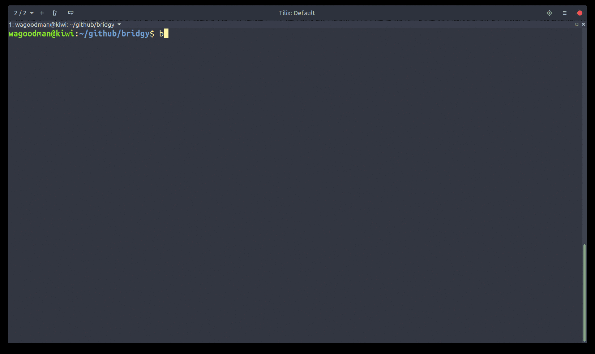

# bridgy

  [](https://badge.fury.io/py/bridgy)
[](https://codecov.io/github/thomasrockhu/bridgy)
(***WIP/beta***)

**TL;DR**: bridgy = ssh + tmux + sshfs + cloud inventory search

Just get me to my ec2 box with a simple search. Multiple matches? Just
ssh into all matching instances via tmux.



**Features:**
- [x] Custom inventory sources:
  - [x] AWS (supports matching by tag, dns, or instance-id)
  - [ ] GCP
  - [x] New Relic
  - [x] CSV
  - [ ] Ansible inventory
- [x] Search against multiple inventory sources simultaneously
- [x] Connect to inventory sources via a bastion/jumpbox
- [x] Fuzzy search against the inventory
- [x] Prompt for single/multi selection for matched hosts in inventory
- [x] Open multiple ssh connections via tmux (splits or tabs)
- [x] Configure custom tmux layouts (via config)
- [x] Seamless connection via bastion (via config)
- [x] Setup sshfs mount to a remote dir
- [x] Run custom command on login (via config)
- [x] Run arbitrary ansible playbooks
- [x] Push / pull files (via ansible fetch/copy task)
- [ ] Ssh tunnel to hosts
- [x] ECS support (exec to container, currently only via new relic inventory)
- [x] Python3 support :)

**(Want a feature? Just [create an issue](https://github.com/wagoodman/bridgy/issues/new?labels=enhancement) describing it)**

## Installing

**Linux**
```bash
pip install --user bridgy

# optionally support sshing into multiple systems at once
sudo apt install tmux

# optionally support remote mounts
sudo apt install sshfs

# put this into your ~/.bashrc (pip install --user does not put bins in the 'right' spot for everyone: https://github.com/pypa/pip/issues/3813)
export PATH=${HOME}/.local/bin:$PATH
```
**Note:** you may still need to add bridgy to your path!

**OSX**
```bash
sudo easy_install pip
pip install --user bridgy --ignore-installed six

# optionally support sshing into multiple systems at once
brew install tmux

# optionally support remote mounts
brew cask install osxfuse
brew install sshfs

# put this into your ~/.bash_profile (pip install --user does not put bins in the 'right' spot for everyone: https://github.com/pypa/pip/issues/3813)
export PATH=${HOME}/.local/bin:$PATH
```

**Windows**
```
¯\_(ツ)_/¯
```

## Getting started
After installing, create a configuration file by running
```bash
$ bridgy init
```
This will create a default `~/.bridgy/config.yml` file for you. From there you need to configure inventory sources and other options:

```yaml
config-schema: 2
inventory:
  source:

    - type: csv
      name: on-site servers
      # CSV files are placed in ~/.bridgy/inventory/csv
      file: somefile.csv
      # requires at least name and address
      fields: name, address

    # Inventory parameters to support querying AWS using boto profiles
    - type: aws
      name: test
      profile: a-boto-profile-name
      region: us-west-2


# define ssh behavior and preferences
ssh:
  user: awesome-user
  options: -C -o ServerAliveInterval=255
  command: sudo -i su - another-user -s /bin/bash
  tmux: false
```
Now you can ssh into a system referenced from the given inventory sources:
```bash
# without tmux
$ bridgy ssh someserver

# with tmux (or set the ssh.tmux=true config option to always use tmux)
$ bridgy ssh -t someserver
```
That's just to get you started, there is plenty more you can do though!

Have a special multi-pane tmux layout for every system you login to? Drop it in
the config, reference it by name:
```yaml
tmux:
  layout:
    logger:
      - cmd: split-window -h
      - cmd: split-window -h
      - cmd: split-window -v
        run: tail -f /var/log/messages
      - cmd: set-window-option synchronize-panes on
```
then...
```bash
$ bridgy ssh -tl logger awesomebox
```

Want to remotely mount a dir from your ec2 instance over ssh locally?

```bash
$ bridgy mount awesomebox:/appdir
[?] What instances would you like to have mounted? (enter to select):
 > o dev-myawesomeboxname                   (10.10.60.220)
   o qa-myawesomeboxname                    (10.10.63.13)

Mounted dev-myawesomeboxname:/tmp at ~/.bridgy/mounts/dev-myawesomeboxname
```

Need to connect to your boxes via a jumpbox? Drop in your bastion connection information in the config:
```yaml
bastion:
  user: some-username
  address: some-ip-or-host
  # optional ssh arguments
  options: -C -o ServerAliveInterval=255 -o FingerprintHash=sha256 -o TCPKeepAlive=yes -o ForwardAgent=yes -p 22222
```

Need a different bastion for a given inventory source, override it:
```yaml
inventory:
  source:

    - type: csv
      name: on-site servers
      file: anawesome.csv
      fields: name, address
      # if you need to connect to aws hosts via a bastion, then
      # provide all connectivity info in each inventory item
      # (each inventory source bastion overrides the global bastion configuration)
      bastion:
        user: a-better-username
        address: someotherhost.com
        options: -C -o ServerAliveInterval=60

bastion:
  user: some-username
  address: some-ip-or-host.com
  options: -C -o ServerAliveInterval=255 -o FingerprintHash=sha256 -o TCPKeepAlive=yes -o ForwardAgent=yes -p 22222
```

The same override functionality is available for ssh options and pattern matchers:
```yaml
inventory:
  source:

    - type: csv
      name: on-site servers
      include_pattern: .*meh_.*
      file: anawesome.csv
      fields: name, address
      ssh:
        user: a-better-username
        options: -C -o ServerAliveInterval=60

ssh:
  user: some-username
  options: -C -o ServerAliveInterval=255
```

Want to perform arbitrary tasks? Drop an ansible playbook in config, reference it by name (`grab-files`):
```yaml
run:
  grab-files:
    - hosts: app-srv-13, dev-srv
      gather_facts: no
      tasks:
        - name: 'Get secrets.yml'
          fetch:
            src: /appdir/config/secrets.yml
            dest: /tmp/prefix-{{ inventory_hostname }}.secrets.yml
            fail_on_missing: yes
            flat: yes
        - name: 'Get production.rb'
          fetch:
            src: /appdir/config/environments/production.rb
            dest: /tmp/prefix-{{ inventory_hostname }}.production.rb
            fail_on_missing: yes
            flat: yes
        - name: 'Get database.yml'
          fetch:
            src: /appdir/config/database.yml
            dest: /tmp/prefix-{{ inventory_hostname }}.database.yml
            fail_on_missing: yes
            flat: yes
```
then...
```bash
$ bridgy run grab-files

PLAY [app-srv-13, dev-srv] *****************************************************

TASK [Get secrets.yml] ********************************************************
ok: [dev-srv]
ok: [app-srv-13]

TASK [Get production.rb] ******************************************************
ok: [dev-srv]
ok: [app-srv-13]

TASK [Get database.yml] *******************************************************
ok: [dev-srv]
ok: [app-srv-13]

$ ls -1 /tmp | grep prefix
prefix-dev-srv.database.yml
prefix-dev-srv.production.rb
prefix-dev-srv.secrets.yml
prefix-app-srv-13.database.yml
prefix-app-srv-13.production.rb
prefix-app-srv-13.secrets.yml

```

Want to exec into a running container in ECS? (only via new relic inventory is supported)

```bash
$ bridgy exec awesome
[?] What containers would you like to exec into? (enter to select):
 > o dev-myawesomecontainer
   o qa-myawesomecontainer
```

## Config Reference
An exhaustive list of options you can put in the config, with some example values:
```yaml
config-schema: 2
inventory:

  update_at_start: false      # update the inventory sources on each run
  fuzzy_search: true          # allow for more that partial matching, you only need to get 'close'
  exclude_pattern: '.*qa.*'   # exclude instances that match the given regex
  include_pattern: '.*qa.*'   # include only instances that match the given regex

  # in case you need to use this behind a proxy
  http_proxy: http://someurl.com:80 
  https_proxy: http://someurl.com:80 

  source:

    # Example with a CSV
    - type: csv
      name: On-site
      # CSV files are placed in ~/.bridgy/inventory/csv
      file: primary-site.csv
      delimiter: '|'
      # requires at least name and address
      fields: index, name, address, other, random, fields

    - type: aws
      name: Offsite
      # ~/.aws/* configs will be referenced by default, but can be overridden here: 
      access_key_id: AdfhjskfhdkfjfhskfTQ(fake)
      secret_access_key: ZdhfjkshfkjdhfjshfkhfjsE5xx/dhfjksdhfksjf(fake)
      session_token: someawesometoken(fake)
      region: us-west-2

    # Inventory parameters to support querying AWS using boto profiles
    - type: aws
      name: Offsite DR
      profile: offsite-dr-servers
      region: us-west-2

    # All inventory parameters to support querying New Relic
    - type: newrelic
      name: web-production
      account_number: ACCOUNT_NUMBER
      insights_query_api_key: API_KEY

    # You can always use a specific bastion for each inventory source if you want (that overrides the global bastion)
    - type: aws
      name: Offsite DR
      profile: offsite-dr-servers
      region: us-west-2
      # the real bastion!...
      bastion:
        user: jumper
        address: someothersystem.com
        options: -C -o ServerAliveInterval=30 -o TCPKeepAlive=yes

# define ssh behavior and preferences
ssh:
  user: awesome-user
  # Any valid ssh cli options you would specify to SSH (optional)
  options: -C -o ServerAliveInterval=255
  # Run a command upon logging into any host (optional)
  command: sudo -i su - another_user -s /bin/bash
  # Use Tmux to wrap all ssh sessions (optional)
  tmux: true


# This specifies any SSHFS options for mounting remote directories
sshfs:
  # Any sshfs option that you would specify to sshfs (optional)
  # Tip: if you need to be another user on the remote system you can do so via sudo:
  # options: -o sftp_server="/usr/bin/sudo /usr/lib/openssh/sftp-server"
  options: -o auto_cache,reconnect,no_readahead -C -o TCPKeepAlive=yes -o ServerAliveInterval=255 -o StrictHostKeyChecking=no

# configure your bastion here if it applies to all of your inventory sources
bastion:
  # User to use when SSHing into the bastion host (optional)
  user: johnybgoode
  # Address of the bastion host
  address: zest
  # Any valid cli options you would specify to SSH (optional)
  options: -C -o ServerAliveInterval=255


tmux:
  # You can make multiple panes to a single host by specifying a layout definition. Simply
  # define each tmux command to run and an optional command to run in that pane.
  # Use these layouts by name with the -l cli option (bridgy ssh -l somename host...)
  layout:
    # bridgy ssh -l example host...
    example:
      - cmd: split-window -h
        #run: sleep 1
      - cmd: split-window -h
        #run: sleep 2
      - cmd: split-window -v
        #run: sleep 3

    logger:
      - cmd: split-window -h
      - cmd: split-window -h
        run: sh -c "cd /webapps; exec sh"
      - cmd: split-window -v
        run: sudo su - -c 'tail -f /webapps/app-*/log/production.log'

# ansible specific configuration (for 'run' profiles)
ansible:
  become_user: root
  become_method: sudo

# an example set of ansible tasks to run against select servers (bridgy run grab-files)
run:
  grab-files:
    - hosts: app-srv-13, dev-srv
      gather_facts: no
      tasks:
        - name: 'Get secrets.yml'
          fetch:
            src: /appdir/config/secrets.yml
            dest: /tmp/prefix-{{ inventory_hostname }}.secrets.yml
            fail_on_missing: yes
            flat: yes

```

## Usage
```
  bridgy init
  bridgy ssh (-t | --tmux) [-adsuvw] [-l LAYOUT] [-i SOURCE] <host>...
  bridgy ssh [-duv] [-i SOURCE] <host>
  bridgy exec (-t | --tmux) [-adsuvw] [-l LAYOUT] [-i SOURCE] <container>...
  bridgy exec [-duv] [-i SOURCE] <container>
  bridgy list-inventory [-i SOURCE]
  bridgy list-mounts
  bridgy mount [-duv] [-i SOURCE] <host>:<remotedir>
  bridgy unmount [-dv] [-i SOURCE] (-a | <host>...)
  bridgy run <task>
  bridgy update [-v] [-i SOURCE] 
  bridgy (-h | --help)
  bridgy --version

Sub-commands:
  init          create the ~/.bridgy/config.yml
  ssh           ssh into the selected host(s)
  exec          exec into the selected container(s) (new relic + ecs only)
  mount         use sshfs to mount a remote directory to an empty local directory
  unmount       unmount one or more host sshfs mounts
  list-mounts   show all sshfs mounts
  run           execute the given ansible task defined as playbook yml in ~/.bridgy/config.yml
  update        pull the latest inventory from your cloud provider

Options:
  -a        --all            Automatically use all matched hosts.
  -d        --dry-run        Show all commands that you would have run, but don't run them (implies --verbose).
  -i SOURCE --source SOURCE  Search a subset of inventories by name (comma separated for multiple values)
  -l LAYOUT --layout LAYOUT  Use a configured tmux layout for each host.
  -s        --sync-panes     Synchronize input on all visible panes (tmux :setw synchronize-panes on).
  -t        --tmux           Open all ssh connections in a tmux session.
  -u        --update         pull the latest instance inventory from aws then run the specified command.
  -w        --windows        Use tmux windows instead of panes for each matched host.
  -h        --help           Show this screen.
  -v        --verbose        Show debug information.
  --version                  Show version.

Configuration Options are in ~/.bridgy/config.yml
```
